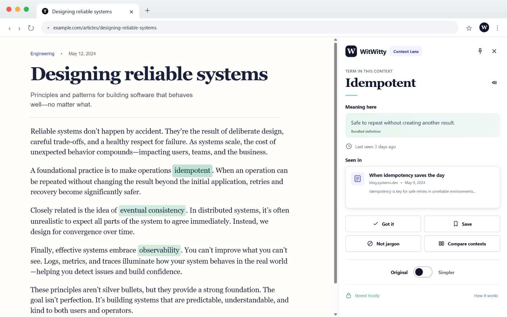

# WitWitty

A Chrome extension that explains unfamiliar jargon right where you hit it — in the sentence, on the page you're already reading.

[Live demo](https://witwitty-demo.vercel.app) · [Docs](docs/) · [License](LICENSE)

## Series context

WitWitty is a series-adjacent experiment in the same human-in-the-loop portfolio. It does not currently have a dedicated published installment; the broader writing is available from the [*Looping in the Human* author page](https://substack.com/@henryflowers45).



## Features

- Explicit, one-click scanning — never runs in the background, never touches a page you didn't ask it to.
- Highlights unfamiliar terms inline and explains them in the exact sentence they appear in, not a generic dictionary entry.
- Fails closed on acronyms it doesn't recognize instead of guessing.
- Tracks what you've learned with spaced review — Got it, Save, or Not jargon — and resurfaces terms before you forget them.
- Reversible Original/Simpler toggle that rewrites jargon in place without ever losing the original text.
- Optional AI fallback for terms it can't resolve locally: bring your own endpoint and key, see the exact payload before anything sends, accept or discard every proposal yourself.
- Everything — history, saved terms, review progress — stays in your browser. No account, no sync, no telemetry.

## Quick start

```bash
pnpm install --frozen-lockfile
pnpm build
```

Open `chrome://extensions`, enable Developer mode, choose **Load unpacked**, and select the generated `dist/` folder. Click the WitWitty toolbar icon on any article to scan it.

Prefer to look before you install? Try the [live demo](https://witwitty-demo.vercel.app) — a static walkthrough with a scripted example of the AI flow, no install and no key required.

## How it works

A content script scans the active tab on click, ranks jargon/acronym candidates against a small reviewed glossary, and highlights the matches. A side panel shows the meaning, review history, and — for terms it can't resolve — an optional bring-your-own-key AI explanation, disclosed in full before anything is sent. Details: [docs/architecture.md](docs/architecture.md).

## Privacy

- Reading history and saved terms never leave your browser; there's no account or sync.
- The AI fallback makes zero network requests until you configure your own endpoint — verified by an automated test.
- Before any request, you see the exact outbound payload and destination, with a Cancel that sends nothing.

Full detail: [docs/privacy.md](docs/privacy.md).

## License

[MIT](LICENSE)
