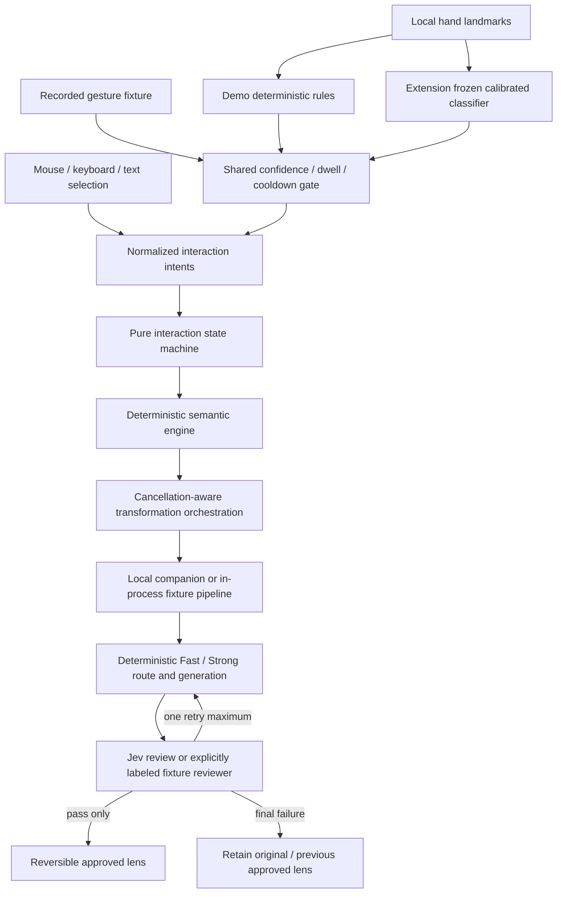

# Architecture and invariants

## Shared primitives, thin surfaces



`src/core/` is independent of either surface. `src/browser/runtime.ts` is the common orchestration controller; the demo and content-script entry points assemble it. Native DOM/Shadow DOM controls avoid bundling a separate application/state implementation into each surface. The old React-based V0.1 remains untouched; this is not a migration of its learning-history database or browser-side credential flow.

| Location | Responsibility |
| --- | --- |
| `core/contracts.ts` | Shared schemas, input bounds, depth contracts, route rules, abort/timeouts |
| `core/semantic.ts` | Original-source graph, ranges, snapping, anchors, mutation updates |
| `core/machine.ts` | Pure transitions and explicit effects; allowlisted external intents |
| `core/pipeline.ts` | Generator/reviewer ports, prompt, bounded cache, review/retry gate |
| `core/privacy.ts` | Sensitive-site rules, saved-item schema, safe exports |
| `browser/runtime.ts`, `lens.ts` | Shared orchestration, pre-paint validation, source-preserving rendering |
| `browser/inputs.ts`, `replay.ts` | Mouse/text/keyboard and recorded adapters |
| `gesture/engine.ts` | Landmarks, features, rules, calibration, frozen classifier, shared gate |
| `browser/camera*.ts` | Explicit capture, local worker, calibration studio |
| `extension/`, `src/extension/` | Toolbar, authorization, ports, options, local storage |
| `companion/` | Real HTTP service, credential boundary, concrete generation/Jev adapters |
| `fixtures/`, `tests/` | Authored model fixtures, gesture sequences and acceptance evidence |

## Semantic graph

The only hierarchy is **Document → Section → Paragraph → Sentence → Term**. Headings delimit sections; nested headings are flattened into this strict five-level model rather than adding new scope levels. Headings themselves are preserved, not rewritten. Paragraph-like blocks include list items, quotations, code blocks and detectable math. Nested blocks are indexed once. Tables, figures, forms, navigation, scripts and WitWitty-owned UI are excluded.

English sentence segmentation is versioned deterministic code. It handles common abbreviations, initials, decimals, punctuation and quotes; it is not a multilingual linguistic parser. Terms use Unicode letter/number ranges. Stable paragraph IDs survive bounded incremental text updates. Section IDs may change on structural rebuild; every relevant source change invalidates pending work first, so an old result cannot attach to a new section.

Snapping ranks candidates at the current scope by distance to visible semantic ranges, then center distance, then stable DOM order. The maximum default distance is 160 pixels. Debug traces retain the six leading candidates and the winning reason. Ties are not delegated to a model. Inward zoom chooses the child containing the original paragraph/character anchor; outward zoom uses the parent. Document/Term boundaries are no-ops.

Text selection can cross inline markup. A multi-paragraph selection maps to its common Section or Document. The original semantic graph remains authoritative even while a rewritten clone is visible. Fine-grained pointer geometry within paraphrased text is not an alignment model: Sentence/Term geometry on a rewrite clone uses its paragraph envelope. Zoom retains the source anchor; restore the original for precise new text selection within rewritten wording.

## Explicit state

The pure transition function returns `{state, effects}`. Effects are limited to cancellation, restoration, generation and scrolling. UI callbacks do not choose semantic scope or run independent business logic.

```text
inactive → acquiring_target → target_hovered → target_locked
  → generating → reviewing → lens_active
  → replacement_generating → replacement_reviewing → lens_active
  → restored
```

`failed`, `cancelled` and source invalidation are explicit. State tracks session, original anchor, hovered/locked targets, scope, mode, depth, request identity/epoch, original text, approved block results, progress, failure, companion state and camera state. Mode changes preserve the target and depth. An active lens is not erased merely because replacement generation started or failed; the HUD explicitly distinguishes requested state from a still-displayed previous approval.

Every cancellation/target/scope/depth/source change advances or invalidates request identity. Abort signals stop cooperative work; epoch checks also reject late results from noncooperative adapters. Scope changes use the original graph, not the model output.

## Reversible rendering

Explain inserts a plain-text, visually distinct note at the selected block. Rewrite creates a sanitized clone and transforms only the approved eligible text segments in that clone. Original text nodes, element identity and event listeners are retained; the original block is temporarily hidden and its prior `hidden` attribute is recovered exactly on restore. Restoring does not recreate an approximation of the old HTML.

Models return text or `{id,text}` edits, never replacement HTML. Segment IDs and coverage must match. Protected code/math segments remain unchanged. Clones strip duplicate IDs, event attributes, executable widgets, forms and unsafe URL schemes. Headings, paragraph/list structure, links, emphasis and protected inline code survive. Dynamic source changes restore the lens instead of overwriting the host site's new content.

A new context is prepared off-DOM. The first approved replacement switches the coherent lens context; later approved blocks arrive progressively. A failed block stays original, and a fully rejected replacement retains the previous approved lens. No draft or rejected text enters the DOM, saved library or debug trace.

For Section/Document Explain, a reviewed coherent overview is generated first when the explicit selection is within 12,000 characters, followed by independently reviewed block contributions. Larger selections use block-local explanations with a visible overview-limit notice. Rewrite remains block-local. Large scopes over 500 blocks fail explicitly rather than silently transforming only a prefix.

## Dynamic pages and limits

The observer invalidates immediately, coalesces at 100 ms, updates affected text blocks, and uses a bounded full rebuild for structural changes. It does not rebuild on every pointer or frame. Owned lens insertions do not become source mutations. Paragraph IDs stay stable across rebuilds of unchanged elements.

Indexing is capped at 2,000 blocks and 250,000 source characters; individual blocks above 12,000 characters are omitted with a visible bounded-index notice. Request segments are capped at 120; source/context/output limits are centrally validated. These are explicit V1 resource limits, not silent claims to understand an entire unlimited DOM.

## Progress, cache and provenance

The runtime consumes approved results progressively and tracks approved/failed/completed blocks separately. At most two adjacent lower-depth results are predicted for a single Fast-model selection. It never speculatively buys Strong-model work. Selection, scope, navigation, session end and restoration cancel stale work.

The in-memory LRU cache is bounded to 64 entries, 2 MB and 15 minutes. Its key includes session, source/context/segments, target/block/scope/mode/depth, contract version, model and reviewer identities, and fixture failure scenario. Only approved transformations enter it; a cache hit still passes the browser's identity/schema/source-hash/review validation.

Provenance records route/reason, provider/reviewer identity, review scores, attempt, contract, source hash, cache status, generation/review times and fixture labeling. Debug views and exports contain IDs/metadata, not raw source, drafts, prompts, keys, frames or browsing history.
